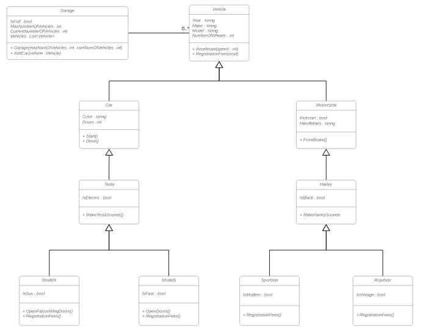

# Object Oriented Programming
Object Oriented Programming is a type of programming that is based on the concept of creating or mimicking real world "objects" in code.  Each object may contain relevant data or methods.  This repository concentrates on the four pillars of Object Oriented Programming (Encapsulation, Inheritance, Abstraction, Polymorphism), and how it looks in C# through the domain of a Vehicle interacting with a Garage.  

#### Vehicle Heirarchy 



## Encapsulation
Encapsulation is the concept of containing related attributes(data) and behavior(methods) inside of a single class.  This also allows you to restrict access from one class to another using C# access modifiers like private, protected, internal, etc.

```c#

   // our Vehicle class uses public & abstract access modifiers so it can be accessed by other derived classes, but all of the attributes are encapsulated inside of this class
    public abstract class Vehicle
    {
        // Attributes
        public int Year { get; set; }
        public string Make { get; set; }
        public string Model { get; set; }
        public int NumberOfWheels { get; set; }

        // Methods
        public void Accelerate(int speed)
        {
            Console.WriteLine($"This vehicle is accelerating at a rate of {speed} mph");

        }

    }
    
```

## Abstraction
Abstraction is the concept that allows someone to limit the amount of complexity that you use or see from an object.  In this case, we can instantiate our vehicle and use it's OpenFalconWingDoors method, without knowing how it works.  We only need to know that we have access to the method inside the class.

```c#
     // instantiating our Model X, and calling the open doors method
     ModelX modelx = new ModelX();
     modelx.OpenFalconWingDoors();
```

## Inheritance
Ineritance is the concept of basing one object or class off of another. Inheritance of one class into another allows each derived class to contain the attributes or methods from the base or abstract class.  Here we show inheritance from the Vehicle class containing the Accelerate method, but instantiated on the most derived class ModelX.  See picture above to see diagram of base class.

```c#
      // integer declared to satisfy the parameter needed for the Accelerate method
      int speed = 20;
       
      // instantiting the class & calling the Accelerate method, which is a method inherited from our Vehicle class
      ModelX modelx = new ModelX();
      modelx.Accelerate(speed);
       
      // syntax for inheriting a class.  Tesla inherits from Car, and Car inherits from Vehicle, so ModelX can inherit properites from Vehicle.
      public class ModelX : Tesla
      {
       
      }

```

## Polymorphism
Polymorphism is the concept that a single interface can occur in many different forms.  In C#, this means we can take a single method from a base or abstract class, and implement it on a derived class in a different way.  We do this using *virtual* and *override* keywords
```c#
  
       // the original method belonging to the Vehicle class.  To allow a method to be changed on a derived class, it must use the virtual keyword
       public virtual void RegistrationFees()
       {
           Console.WriteLine("Every Vehicle needs to be registered");
       }
        
       // this method being called in the ModelX class, it uses the override keyword to allow changes to the implementation of the method.  When called in our program, it will output our new string to the console
       public override void RegistrationFees()
       {
           Console.WriteLine("Model X Registration fees are $50");
       }


```
